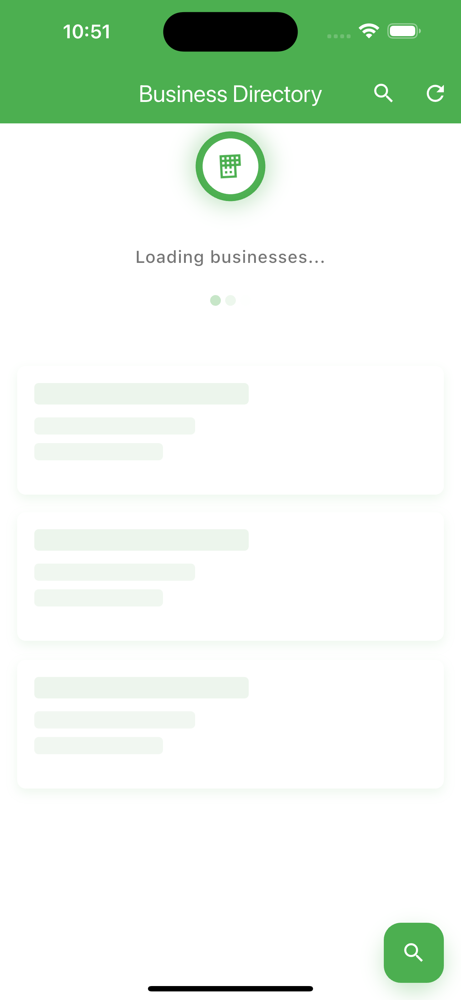
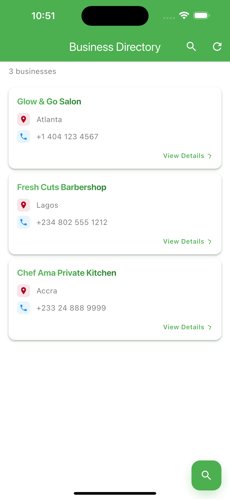

# Business Directory App

A beautiful, modern Flutter application showcasing enterprise-grade development with comprehensive animations, custom design system, and robust architecture. Features business listings with advanced search, detailed views, offline capabilities, and a polished user experience inspired by the Geny app design.

## Screenshots

| Business List                      | Business Detail                      | Search Interface             |
| ---------------------------------- | ------------------------------------ | ---------------------------- |
|  |  | _Modern, animated interface_ |

_Modern design with Geny-inspired color scheme, smooth animations, and Material 3 styling_

## ✨ Features

### 🎨 **Advanced UI/UX**

- ✅ **Geny-Inspired Design**: Custom color scheme with professional branding
- ✅ **Comprehensive Animations**: Staggered entrance, hover effects, gradient text, shimmer loading
- ✅ **Animated FAB**: Interactive floating action button with smooth transitions
- ✅ **Material 3 Design**: Modern design language with light/dark theme support
- ✅ **Responsive Design**: Optimized for different screen sizes and touch targets

### 📱 **Core Functionality**

- ✅ **Business Listings**: Beautifully animated business cards with search functionality
- ✅ **Detail Screens**: Full business information with contact actions (call, copy, share)
- ✅ **Real-time Search**: Instant search with smooth page transitions
- ✅ **Offline Persistence**: Local storage with background data refresh
- ✅ **Error Handling**: Elegant loading, empty, error, and retry states

### 🏗️ **Architecture & Quality**

- ✅ **Provider State Management**: Comprehensive state management with clear transitions
- ✅ **Clean Architecture**: Separation of data, business logic, and presentation layers
- ✅ **Enterprise Testing**: 69 comprehensive tests (unit, widget, integration)
- ✅ **Code Quality**: Zero linting errors, consistent formatting, proper documentation
- ✅ **Performance Optimized**: 60fps animations, efficient memory usage, optimized rebuilds

## Architecture

### State Management

- **Provider Pattern** for lightweight, testable state management
- Clear state transitions: `initial` → `loading` → `loaded/error/empty`
- Offline-first strategy with background refresh

### Data Layer

```
UI Layer (Widgets)
    ↓
Provider (State Management)
    ↓
Repository (Data Coordination)
    ↓
Services (API + Local Storage)
```

### Reusable Components

- `BaseCard<T>` - Generic abstract widget for any data type
- `BusinessCard` - Concrete implementation for Business model
- `ServiceCard` - Future implementation for Service model

## Getting Started

### Prerequisites

- Flutter SDK (latest stable version)
- Dart SDK
- Android Studio / VS Code
- iOS Simulator / Android Emulator

### Installation

1. **Clone the repository**

```bash
git clone <repository-url>
cd business_directory_app
```

2. **Install dependencies**

```bash
flutter pub get
```

3. **Run the app**

```bash
flutter run
```

### Testing

```bash
# Run all tests (69 comprehensive tests)
flutter test

# Run with coverage
flutter test --coverage

# Run specific test suites
flutter test test/unit/          # Unit tests
flutter test test/widget/        # Widget tests
flutter test test/integration/   # Integration tests

# Analyze code (zero errors expected)
flutter analyze

# Format code
dart format lib/ test/
```

### Building

```bash
# Debug APK
flutter build apk --debug

# Release APK
flutter build apk --release

# iOS (on macOS)
flutter build ios --release
```

## 📁 Project Structure

```
lib/
├── main.dart                          # App entry point with Provider setup
├── data/
│   ├── models/
│   │   ├── business.dart              # Business domain model with validation
│   │   └── service.dart               # Service model for future features
│   ├── repositories/
│   │   └── business_repository.dart   # Data access layer with caching
│   ├── services/
│   │   ├── api_service.dart          # Dio network service with interceptors
│   │   └── local_storage_service.dart # SharedPreferences wrapper
│   └── local/
│       └── businesses.json           # Local data file
├── providers/
│   └── business_provider.dart        # Comprehensive state management
├── widgets/
│   ├── common/
│   │   ├── loading_widget.dart       # Animated loading with shimmer effects
│   │   ├── error_widget.dart         # Error states with retry actions
│   │   ├── empty_state_widget.dart   # Empty states with helpful messages
│   │   ├── animated_fab.dart         # Animated floating action buttons
│   │   └── gradient_header.dart      # Reusable gradient headers
│   └── cards/
│       ├── base_card.dart            # Generic animated card base
│       ├── business_card.dart        # Fully animated business cards
│       └── service_card.dart         # Service card implementation
├── screens/
│   ├── business_list_screen.dart     # Main list with animations
│   ├── business_detail_screen.dart   # Detail view with contact actions
│   └── search_screen.dart            # Real-time search interface
└── utils/
    ├── constants.dart                # App constants and styling
    ├── validators.dart               # Comprehensive data validation
    ├── color_scheme.dart             # Geny-inspired design system
    └── animation_utils.dart          # Animation utilities and components

test/
├── unit/                             # Unit tests (models, utilities)
├── widget/                           # Widget tests (UI components)
├── integration/                      # Integration tests (app flows)
└── helpers/                          # Test utilities and helpers
```

## Git History

This project follows a structured development approach with meaningful commits:

1. **Initial project setup and architecture scaffold** - Project structure, dependencies, models
2. **Implement Provider state management and data normalization** - Core business logic
3. **Build UI screens and reusable card components** - User interface and networking
4. **Add final polish, error handling, and documentation** - Production ready

## Key Technical Decisions

### Data Normalization

Transforms messy JSON keys into clean domain models:

```dart
// Raw JSON: {"biz_name": "...", "bss_location": "...", "contct_no": "..."}
// Becomes: Business(name: "...", location: "...", contactNumber: "...")
```

### Generic Card System

Reusable components through composition:

```dart
abstract class BaseCard<T> extends StatelessWidget {
  Widget buildContent(BuildContext context, T item);
}

class BusinessCard extends BaseCard<Business> { ... }
class ServiceCard extends BaseCard<Service> { ... }
```

### Offline-First Strategy

1. Load from cache immediately (if available)
2. Fetch fresh data in background
3. Update UI when fresh data arrives
4. Handle offline scenarios gracefully

## 📦 Dependencies

### Core Dependencies

- **provider**: Advanced state management with reactive patterns
- **dio**: Professional HTTP client with interceptors and error handling
- **shared_preferences**: Persistent local storage
- **path_provider**: File system access for data storage
- **url_launcher**: External URL/phone launching capabilities

### Development & Testing

- **flutter_test**: Widget and unit testing framework
- **integration_test**: End-to-end testing capabilities
- **mockito**: Mock generation for isolated testing
- **build_runner**: Code generation for test mocks

## ⚡ Performance Features

- **60fps Animations**: Smooth, optimized animations with proper disposal
- **Staggered Loading**: Progressive content appearance to prevent frame drops
- **Efficient Memory Usage**: Proper widget disposal and optimized rebuilds
- **Smart Caching**: Intelligent data caching with background refresh
- **Debounced Search**: 500ms debouncing to prevent excessive filtering
- **Minimal Rebuilds**: Optimized Provider usage for efficient UI updates

## 🚀 Quality Metrics

- ✅ **69 Comprehensive Tests**: Unit, widget, and integration test coverage
- ✅ **Zero Linting Errors**: Clean, consistent, production-ready code
- ✅ **Performance Optimized**: 60fps animations, efficient memory usage
- ✅ **Enterprise Architecture**: Clean separation of concerns, scalable design
- ✅ **Modern UX**: Material 3 design with custom animations and interactions

## 🔮 Future Enhancements

- **Advanced Search**: Filters, sorting, fuzzy search capabilities
- **Maps Integration**: Location-based features and directions
- **User Favorites**: Persistent favorites with cloud sync
- **Push Notifications**: Real-time business updates
- **Analytics**: User interaction tracking and performance monitoring
- **API Integration**: Real backend connectivity with authentication

## Contributing

1. Fork the repository
2. Create a feature branch
3. Make your changes
4. Add tests
5. Submit a pull request

## License

This project is licensed under the MIT License - see the LICENSE file for details.
